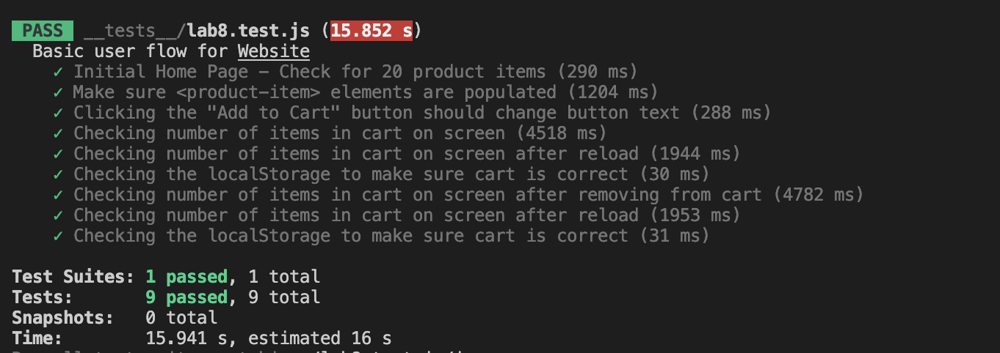
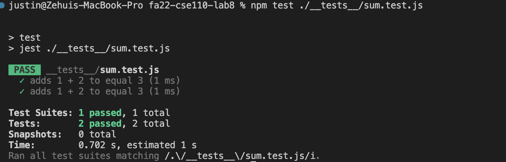

Question 1:
Within a Github action that runs whenever code is pushed. By doing so, Github will run an automatic test every time a piece of code is pushed to a repo and making sure no crashes is happening. Also if something wrong happens, it is very easy to backtrack the point of where the problem occured.

Question 2:
No, because an end to end test is meant to test the interaction bewteen the users and the software, ie the flow of how the user would use the software from begin to end. This does not require certain functions to return the correct value.

Question 3:
No, we should not use Unit Test to test the "message" feature. This is because the "message" feature requires interaction between users, which is not what Unit Test are meant to test.

Question 4:
Yes, Unit Test will be appropriate for testing the "max length message" feature. This is because all we are doing in this feature is limiting the max length, which can be easily done by returning True/False in a Unit Test function.

